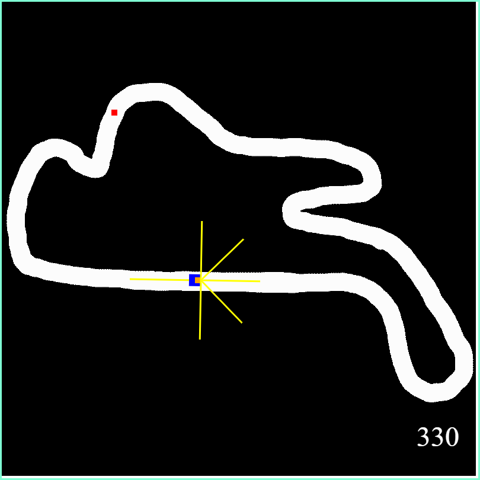
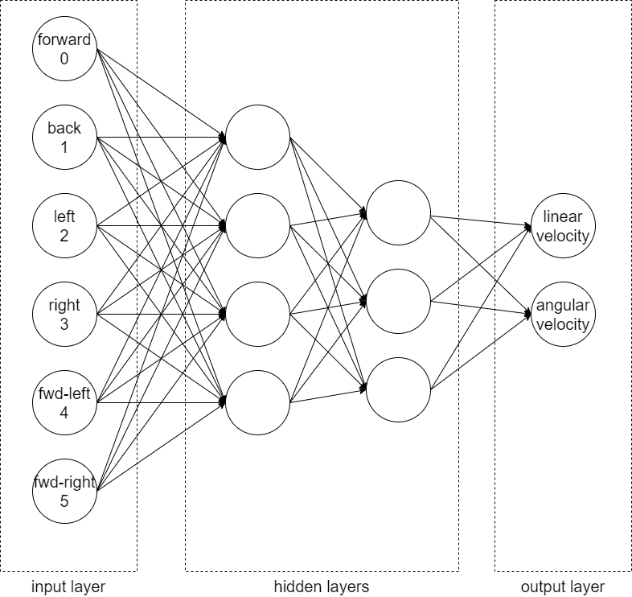

# Genetic Cars
Training a car to drive around a track using AI.



Inspired by and based on:
* [ReInventing Neural Networks](https://www.codeproject.com/Articles/1220276/ReInventing-Neural-Networks)
* [ReInventing Neural Networks - Part 2](https://www.codeproject.com/Articles/1220644/ReInventing-Neural-Networks-Part)
* [ReInventing Neural Networks - Part 3](https://www.codeproject.com/Articles/1231020/ReInventing-Neural-Networks-Part-2)

## Background

<details>

The system is composed of a number of components:
* Car
  * controlled by NeuralNetwork
  * if a car goes off the track, it is destroyed
  * if a car hits a checkpoint, its fitness increases
* Track
  * has a start point
  * has an initial heading from start point aka track direction.  This is so that cars do not go off in the wrong direction!
  * contains many checkpoints
* Checkpoint
  * marker on the track to measure a car's progress
* EvolutionManager
  * creates a large number of cars aka generation
  * waits for all cars to be destroyed
  * creates a new generation of cars based on best car from last generation
* NeuralNetwork
  * takes inputs from a car and generates outputs to control car

</details>

## Neural Network


<details>

* input layer = 6 neurons
  *  LIDAR sensors:
    *  forward
    *  back
    *  left
    *  right
    *  forward-left
    *  forward-right

  Simulates a driver's vision by measuring distance to the track edge in various directions.

* two hidden layers = 4 & 3 neurons

    [How Many Hidden Layers and Hidden Nodes Does a Neural Network Need?](https://www.allaboutcircuits.com/technical-articles/how-many-hidden-layers-and-hidden-nodes-does-a-neural-network-need/)
```
      How Many Hidden Layers?
      [With] one hidden layer allows a neural network to approximate any function involving 
      “a continuous mapping from one finite space to another.”
      With two hidden layers, the network is able to “represent an arbitrary decision boundary 
      to arbitrary accuracy.”

      How Many Hidden Nodes?
      Dr. Heaton mentions three rules of thumb for choosing the dimensionality of a hidden 
      layer. I’ll build upon these by offering recommendations based on my vague 
      signal-processing intuition.

      1. If the network has only one output node and you believe that the required input–output 
          relationship is fairly straightforward, start with a hidden-layer dimensionality that 
          is equal to two-thirds of the input dimensionality.
      2. If you have multiple output nodes or you believe that the required input–output 
          relationship is complex, make the hidden-layer dimensionality equal to the input 
          dimensionality plus the output dimensionality (but keep it less than twice the input 
          dimensionality).
      3. If you believe that the required input–output relationship is extremely complex, set 
         the hidden dimensionality to one less than twice the input dimensionality.
```

    [How to Configure the Number of Layers and Nodes in a Neural Network](https://machinelearningmastery.com/how-to-configure-the-number-of-layers-and-nodes-in-a-neural-network/)
```
      In fact, there is a theoretical finding by Lippmann in the 1987 paper “An introduction to 
      computing with neural nets” that shows that an MLP with two hidden layers is sufficient 
      for creating classification regions of any desired shape.
      This is instructive, although it should be noted that no indication of how many nodes to 
      use in each layer or how to
      learn the weights is given.
      
      ...
      
      ... In practice, we again have no idea how many nodes to use in the single hidden layer 
      for a given problem nor how to learn or set their weights effectively. ...
```

* output layer = 2 neurons
  *  linear velocity
  *  angular velocity

  Simulates a driver accelerating/braking and steering.

</details>

## Car
* currently modelled as a 20x20 pixel sprite
* collision detection only uses (point) position and does not take size into account

## Track

<details>

Currently this is an 800x800 pixel PNG image with the following characteristics:
* track
  * white RGB(255, 255, 255)
  * defines area where cars are allowed to go
  * must be contiguous loop
  * should be 40-50 pixels wide
* off track
  * black RGB(0, 0, 0)
  * defines areas where cars will be destroyed
* start point
  * green RGB(0, 255, 0)
  * 5x5 square on a section of track
  * all cars start from this point
  * there can only be one start point in a track
* direction
  * taken from colour of pixel in upper left hand corner (0, 0)
  * `Direction = px.R + px.G + px.B`
  * should really keep RBG values <= 120 so as not to confuse start point and checkpoint detection
  * specifies initial heading of car from start point
* checkpoint
  * red RGB(255, 0, 0)
  * 5x5 square on a section of track
  * multiple checkpoints around the track
  * recommended to have several checkpoints near start point in track direction to bias cars to follow track direction

</details>

## Notes

<details>

* WASM debugging is unreliable, even with _Visual Studio_
* neural network failed to negotiate even the most favourably configured track (Philip Island),
  even after many generations
* it is unclear if changing number of neurons in hidden layer would improve performance
* graphical representation **really** helped visualisation even though it is slow
* WASM performance is surprisingly good

</details>
